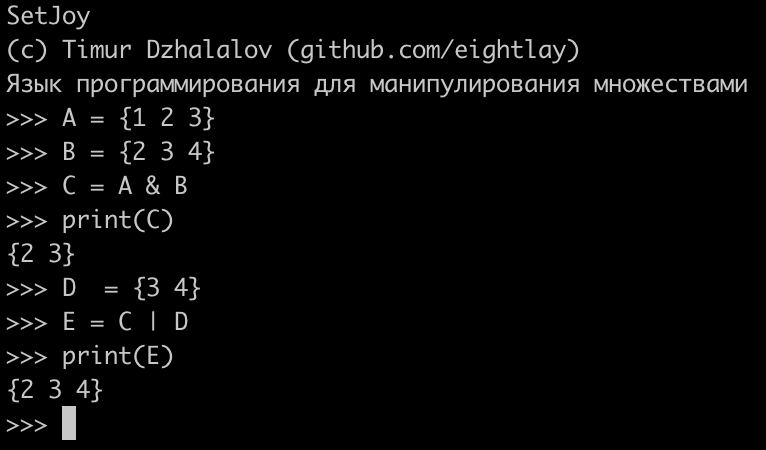

# SetJoy
Programming language for working with sets

## Development status
Sketch stage:
- lexer ✅
- parser ✅
- interpreter ☑ (IN WORK)
- compile into application ❌ (QUEUED)

## How to use
`python3 main.py`

## Example

